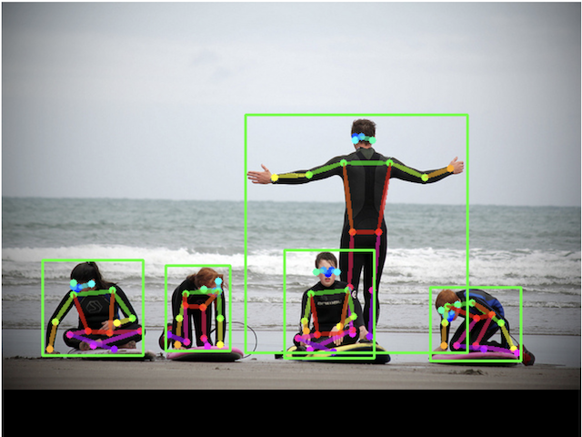

# wasm_hpe_decoder



- Model in use
    - Pose Estimation: SimpleBaseline resnet50 192x256(fp16)
    - Object Detection: Yolov7-tiny 600x600(fp16)

[Sample: Video Stream](https://otmb.github.io/wasm_hpe_decoder)

# Wasm Build

Environment: M1 Mac 13.1(macOS Ventura)  
Reference: [installing emsdk on Apple M1 hardware fails #671](https://github.com/emscripten-core/emsdk/issues/671)

```bash
// emsdk install
$ brew install opencv cmake
$ mkdir ~/src && cd ~/src
$ git clone https://github.com/emscripten-core/emsdk.git
$ cd emsdk
$ git checkout refs/tags/2.0.21
$ ./emsdk install latest
$ ./emsdk activate latest
$ source $HOME/src/emsdk/emsdk_env.sh

// opencv install
$ cd ~/src
$ curl -LO https://github.com/opencv/opencv/archive/refs/tags/4.7.0.zip
$ unzip 4.7.0.zip
$ cd opencv-4.7.0
$ python3 ./platforms/js/build_js.py --emscripten_dir=${EMSDK}/upstream/emscripten --build_wasm build_wasm

$ cd ~/work
$ git clone https://github.com/otmb/wasm_hpe_decoder.git
$ cd wasm_hpe_decoder
$ make
```

# References

- [microsoft/human-pose-estimation.pytorch](https://github.com/microsoft/human-pose-estimation.pytorch)
- [WongKinYiu/yolov7](https://github.com/WongKinYiu/yolov7/blob/main/tools/YOLOv7onnx.ipynb)
- [tensorflow/tfjs-models](https://github.com/tensorflow/tfjs-models/blob/master/posenet/src/util.ts)
- [PaddlePaddle/PaddleDetection](https://github.com/PaddlePaddle/PaddleDetection/blob/develop/deploy/lite/src/keypoint_postprocess.cc)
- [openvinotoolkit/open_model_zoo](https://github.com/openvinotoolkit/open_model_zoo/blob/master/demos/human_pose_estimation_demo/cpp/main.cpp)
- [kounoike/webassembly-night-sample](https://github.com/kounoike/webassembly-night-sample/tree/master/run-by-full-wasm)